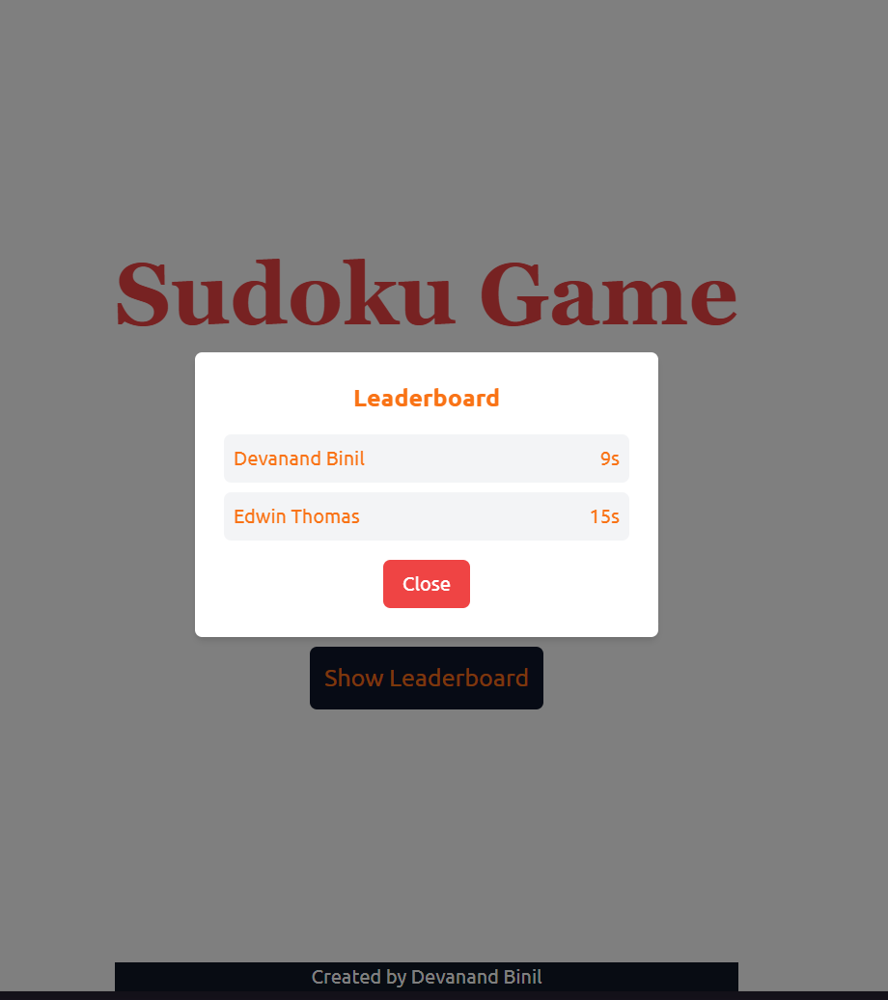

# Sudoku App

## About the Project
This Sudoku App is a modern, interactive web-based platform designed for Sudoku enthusiasts of all skill levels. Built with cutting-edge technologies, the app offers a seamless and engaging experience for users to play, learn, and improve their Sudoku-solving skills.

The app features a clean, minimalistic interface that ensures an enjoyable user experience, whether you're solving puzzles on the go or sitting down for a deep brain workout.

---

## Features

### 🧩 Core Gameplay
- **Multiple Difficulty Levels**: Choose from Easy, Medium, Hard, and Expert levels to match your skill.
- **Interactive Puzzle Solver**: Play Sudoku directly in the browser with real-time updates and error checks.

### 🔧 Advanced Functionalities
- **Hints & Assistance**: Get guided hints when you're stuck without revealing the full solution.
- **Timer and Scoring System**: Track your solving speed with a timer and earn scores based on accuracy and completion time.
- **Error Highlighting**: Automatically highlights invalid moves to help improve your skills.
- **Undo/Redo**: Easily navigate through your moves with full undo/redo capabilities.
- **Pen Tool**: Type answer as superscript without entering it in the puzzle.


### 📊 User Experience
- **Save & Resume**: Save your progress and pick up where you left off anytime.
- **Responsive Design**: Fully optimized for both desktop and mobile devices.

### 📈 Additional Features
- **Puzzle Generator**: Generate infinite puzzles across difficulty levels, ensuring fresh challenges every time.
- **Analytics Dashboard**: View detailed stats such as puzzles solved, fastest times, and average solving time.
- **Leaderboard**: Compete with other players and climb the global leaderboard.

---

## Technologies Used
- **Frontend**: React with Vite for blazing-fast development and performance.
- **Styling**: TailwindCSS for a responsive and modern design along with gsap.
- **State Management**: Zustand for seamless data flow and dynamic updates.

---

## Installation & Setup

1. Clone the repository:
   ```bash
   git clone <repository-url>
   ```

2. Navigate to the project directory:
   ```bash
   cd sudoku-app
   ```

3. Install dependencies:
   ```bash
   npm install
   ```

4. Start the development server:
   ```bash
   npm run dev
   ```

5. Open your browser and navigate to:
   ```
   http://localhost:3000
   ```

---

## Deployment

You can access the deployed application [Sudoku Game](https://sudoku-devan.vercel.app/).

## Screenshots


<div style="display: flex; justify-content: space-around; flex-wrap: wrap;">
  
  
  
  
</div>


---

